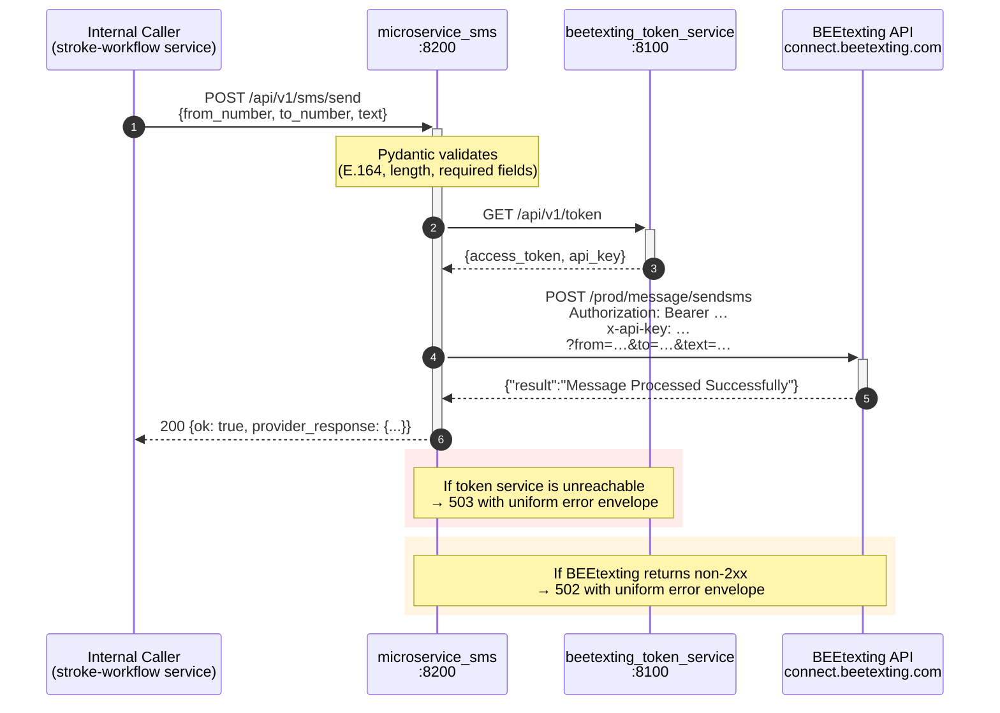
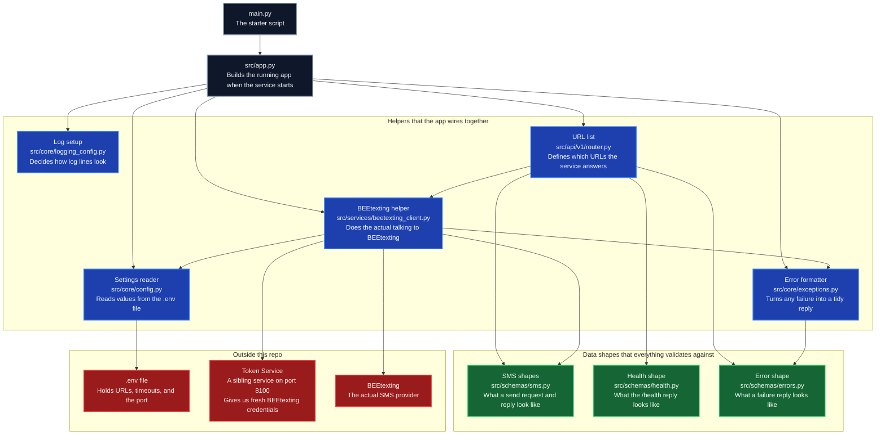

# microservice_sms

A small FastAPI microservice that sends SMS messages via **BEEtexting** on behalf of the NextGen Code Stroke Workflow. It holds **no secrets of its own** — credentials are fetched at call time from the sibling [`beetexting_token_service`](../beetexting_token_service), which caches and proactively refreshes the BEEtexting OAuth2 token.

- **Stack:** Python 3.12 · FastAPI · httpx · Pydantic v2 · pydantic-settings · uv
- **Default port:** `8200`
- **API versioning:** all routes under `/api/v1`
- **Interactive docs:** `http://<host>:8200/docs`

---

## Table of contents
1. [Runtime architecture](#runtime-architecture)
2. [What depends on what](#what-depends-on-what)
3. [Getting started](#getting-started)
4. [Configuration](#configuration)
5. [API reference](#api-reference)
6. [Error envelope](#error-envelope)
7. [Local end-to-end test](#local-end-to-end-test)
8. [Project conventions](#project-conventions)

---

## Runtime architecture

The service is a thin, stateless layer between internal callers and BEEtexting. Every `POST /api/v1/sms/send` triggers one call to the token service (for credentials) and one call to BEEtexting (to actually deliver the message). There is **no persistence** — the service keeps nothing across requests except a shared, pooled `httpx.AsyncClient`.



Key properties:

- **Stateless** — fresh credentials every call; no token caching inside this service (the sibling service already handles that).
- **Pooled** — one shared `httpx.AsyncClient` lives on `app.state` for the lifetime of the process, created in the FastAPI lifespan startup hook, closed on shutdown.
- **Fail-fast** — validation errors never reach BEEtexting; token failures never reach BEEtexting; every error returns the same JSON envelope.

---

## What depends on what

A plain-English dependency tree. Start at the top (the starter script) and follow the arrows — each arrow means *"this file uses that file"*. If a box is green, it's a data shape. If it's red, it's something outside this repo.



**How to read it in one sentence:** *the starter script boots the app, the app wires up five helpers, each helper pulls in the data shapes and outside services it needs, and that's the whole service.*

**What lives where — at a glance:**

| Path                            | Responsibility                                                                                     |
|---------------------------------|----------------------------------------------------------------------------------------------------|
| `main.py`                       | Uvicorn entrypoint. `uv run python main.py` boots the service.                                     |
| `src/app.py`                    | `create_app()` factory and async `lifespan` (owns the shared `httpx.AsyncClient`).                 |
| `src/api/v1/router.py`          | All v1 HTTP endpoints. New versions get their own `src/api/v2/…` folder later.                     |
| `src/core/config.py`            | `Settings(BaseSettings)` — every tunable field loaded from `.env`, validated at startup.           |
| `src/core/exceptions.py`        | `SmsServiceError` hierarchy + handlers that produce the uniform error envelope.                    |
| `src/core/logging_config.py`    | UTC ISO-8601 logging, single stdout stream, noisy libs quieted.                                    |
| `src/schemas/sms.py`            | Pydantic v2 models for request/response/provider/token payloads. E.164 pattern enforced.           |
| `src/schemas/errors.py`         | `ErrorDetail` + `ErrorResponse` — the standard failure envelope.                                   |
| `src/schemas/health.py`         | `HealthResponse` — what `GET /api/v1/health` returns.                                              |
| `src/services/beetexting_client.py` | `BeetextingClient` — the only module that actually speaks HTTP to the token service + BEEtexting. |
| `docs/beetexting_sms_guide.md`  | Reference notes on the BEEtexting REST contract.                                                   |
| `docs/snapshots/initial_bare_minimum.py` | Read-only snapshot of the first three-file iteration, kept for diffing.                       |

---

## Getting started

### Prerequisites
- Python **3.12+**
- [`uv`](https://docs.astral.sh/uv/) installed (`pip install uv` or via winget/brew)
- The sibling `beetexting_token_service` running locally on port **8100** (see [`../beetexting_token_service/README.md`](../beetexting_token_service/README.md)). It supplies the BEEtexting Bearer token and API key that this service forwards.

### Install & run
```bash
# from the repo root
uv sync                    # installs deps into .venv
cp .env.example .env       # (optional) adjust host/port/URLs
uv run python main.py      # starts on http://127.0.0.1:8200
```

Open the interactive Swagger UI: <http://127.0.0.1:8200/docs>

---

## Configuration

All configuration is loaded from environment variables (or a `.env` file in the repo root) via Pydantic Settings. Names are **case-insensitive**.

| Variable                             | Default                                                      | Description                                                       |
|--------------------------------------|--------------------------------------------------------------|-------------------------------------------------------------------|
| `APP_NAME`                           | `microservice_sms`                                           | Service identity in logs and OpenAPI.                             |
| `APP_VERSION`                        | `0.1.0`                                                      | Semantic version surfaced in OpenAPI metadata.                    |
| `APP_HOST`                           | `127.0.0.1`                                                  | Bind address. Use `0.0.0.0` inside containers.                    |
| `APP_PORT`                           | `8200`                                                       | Listener port.                                                    |
| `LOG_LEVEL`                          | `INFO`                                                       | `DEBUG` / `INFO` / `WARNING` / `ERROR` / `CRITICAL`.              |
| `ACCESS_LOG_LEVEL`                   | `INFO`                                                       | Uvicorn HTTP access log verbosity.                                |
| `TOKEN_SERVICE_URL`                  | `http://localhost:8100/api/v1/token`                         | Sibling token service `/token` endpoint.                          |
| `TOKEN_SERVICE_TIMEOUT_SECONDS`      | `10`                                                         | HTTP timeout for the credential fetch.                            |
| `BEETEXTING_SEND_URL`                | `https://connect.beetexting.com/prod/message/sendsms`        | BEEtexting sendsms endpoint.                                      |
| `BEETEXTING_REQUEST_TIMEOUT_SECONDS` | `15`                                                         | HTTP timeout for the send call.                                   |

Startup fails fast on any malformed value (invalid port, unknown log level, bad timeout, etc.).

---

## API reference

All endpoints live under `/api/v1`.

### `POST /api/v1/sms/send`
Send a single SMS via BEEtexting.

**Request body** (`SendSmsRequest`):
```json
{
  "from_number": "+19494248180",
  "to_number":   "+19493137724",
  "text":        "Hi Marko — automated test, please ignore."
}
```
Both phone numbers must match E.164 (`^\+[1-9]\d{1,14}$`). The text body is 1–1600 characters.

**Success** (`200 OK`, `SendSmsResponse`):
```json
{
  "ok": true,
  "provider_response": { "result": "Message Processed Successfully" }
}
```

**Failure codes:**

| Code | When                                                     |
|------|----------------------------------------------------------|
| 422  | Request validation failed (bad E.164, missing field, …). |
| 502  | BEEtexting returned non-2xx or malformed JSON.           |
| 503  | Token service unreachable or returned garbage.           |
| 500  | Any other unexpected failure.                            |

### `GET /api/v1/health`
Probes the token service and reports overall status. Always returns 200; inspect the body:
```json
{
  "status": "healthy",
  "app_name": "microservice_sms",
  "app_version": "0.1.0",
  "token_service_reachable": true
}
```

### `GET /api/v1/ping`
Zero-dependency liveness probe. Returns `{"ping": "pong"}` as long as the process is alive.

---

## Error envelope

Every failure — validation errors, upstream errors, unexpected crashes — returns the same shape:

```json
{
  "ok": false,
  "error": {
    "code": 503,
    "message": "Could not reach token service at http://localhost:8100/api/v1/token: ..."
  }
}
```

This is produced by `register_error_handlers()` in [`src/core/exceptions.py`](src/core/exceptions.py) and matches the `ErrorResponse` schema in [`src/schemas/errors.py`](src/schemas/errors.py).

---

## Local end-to-end test

```bash
# 1. Start the token service (in another terminal)
cd ../beetexting_token_service
uv run python main.py

# 2. Start this service
cd ../microservice_sms
uv run python main.py

# 3. Smoke test
curl http://127.0.0.1:8200/api/v1/ping
curl http://127.0.0.1:8200/api/v1/health

# 4. Real send (edit the phone numbers before firing!)
curl -X POST http://127.0.0.1:8200/api/v1/sms/send \
  -H "content-type: application/json" \
  -d '{
        "from_number": "+1XXXXXXXXXX",
        "to_number":   "+1YYYYYYYYYY",
        "text":        "Dev test, please ignore."
      }'
```

Negative-test hints:
- A non-E.164 number → `422` with the uniform envelope.
- Stop the token service and retry `/sms/send` → `503`.
- Stop this service and hit it → connection refused.

---

## Project conventions

- **Layout.** `src/` directly contains topical subfolders (`api/`, `core/`, `schemas/`, `services/`). This matches the sibling `beetexting_token_service` so both services feel like part of one system.
- **API versioning.** Every route is mounted under `/api/v1`. A future `v2` gets a new `src/api/v2/router.py` and a new `app.include_router(...)` call — nothing in `v1` has to move.
- **Pydantic v2 everywhere.** All schemas use `BaseModel` + `ConfigDict` + `Field(..., description=..., examples=...)`. Immutable upstream/wire models are `frozen=True`.
- **Config via Pydantic Settings.** `os.getenv` is not used anywhere in the service logic — every value flows through `Settings` in `src/core/config.py`.
- **Lifespan-owned resources.** The shared `httpx.AsyncClient` is created in the lifespan startup hook and closed on shutdown. Dependencies pull it off `app.state` via `Depends(get_beetexting_client)`.
- **Uniform error envelope.** Custom exception hierarchy + `register_error_handlers()` guarantee every response — even crashes — matches `ErrorResponse`.
- **UTC logs.** One stdout stream, ISO-8601 UTC timestamps, `httpx`/`httpcore` silenced. Ready for Docker/systemd log capture.

### Out of scope (planned follow-ups)
- Dockerfile / docker-compose
- pytest integration tests (httpx `ASGITransport`)
- Endpoint auth (API key / mTLS)
- Retries with backoff and idempotency keys
- OpenTelemetry metrics and tracing
