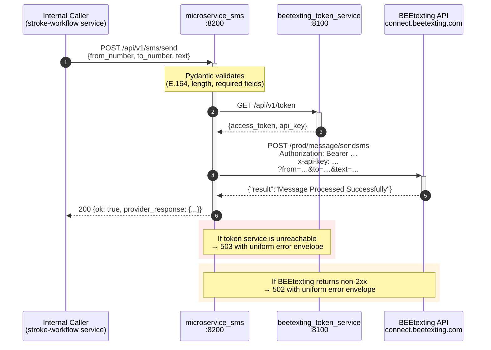
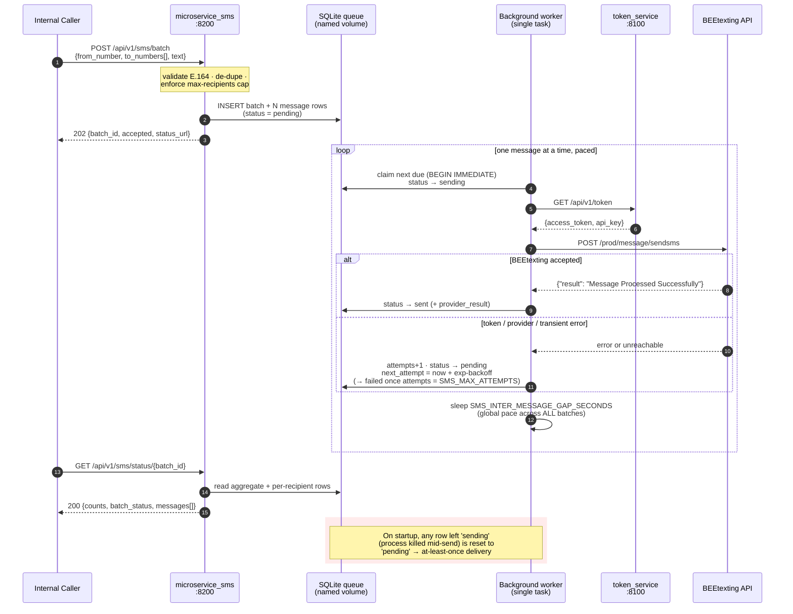
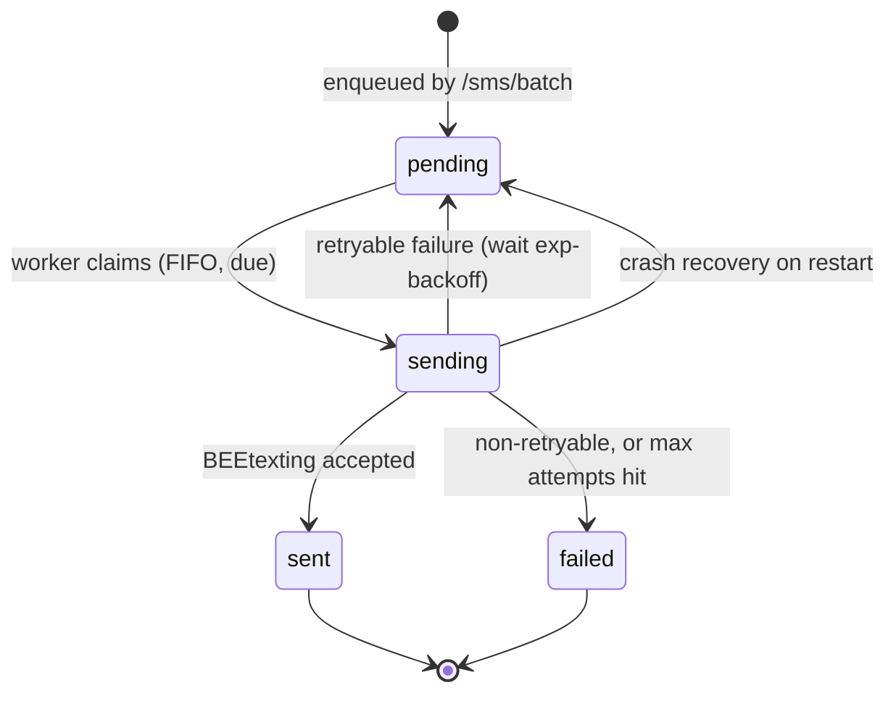
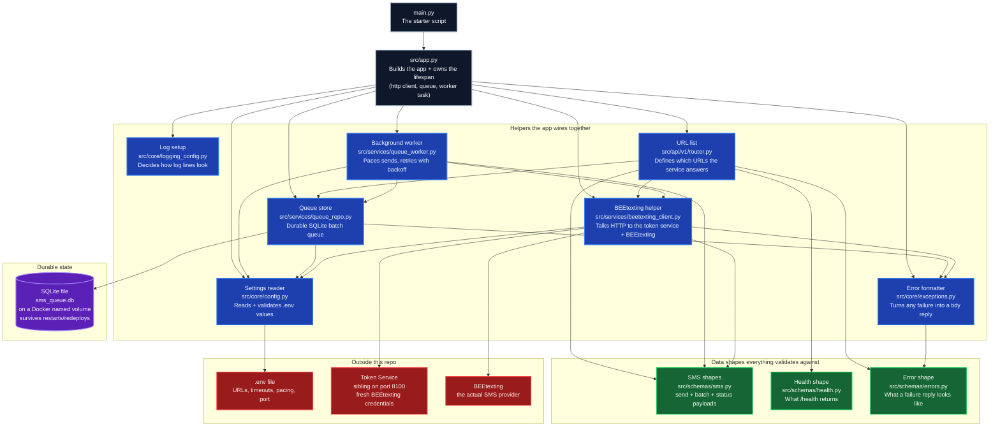

# microservice_sms

A small FastAPI microservice that sends SMS messages via **BEEtexting** on behalf of the NextGen Code Stroke Workflow. It offers two paths: a thin **synchronous single-send** endpoint, and a **durable, globally-paced, retrying batch queue** for fanning the same message out to many recipients. It holds **no secrets of its own** — credentials are fetched at call time from the sibling [`beetexting_token_service`](../beetexting_token_service), which caches and proactively refreshes the BEEtexting OAuth2 token.

- **Stack:** Python 3.12 · FastAPI · httpx · Pydantic v2 · pydantic-settings · aiosqlite · uv
- **Default port:** `8200`
- **API versioning:** all routes under `/api/v1`
- **Interactive docs:** `http://<host>:8200/docs`

---

## Table of contents
1. [Runtime architecture](#runtime-architecture)
2. [What depends on what](#what-depends-on-what)
3. [Getting started](#getting-started)
4. [Configuration](#configuration)
5. [API reference](#api-reference)
6. [Error envelope](#error-envelope)
7. [Local end-to-end test](#local-end-to-end-test)
8. [Project conventions](#project-conventions)

---

## Runtime architecture

The service exposes **two send paths**:

- **`POST /api/v1/sms/send`** — the original thin, synchronous, single-recipient path. One call to the token service (for credentials) and one call to BEEtexting, result returned inline. Holds nothing across requests. Unchanged.
- **`POST /api/v1/sms/batch`** — the same message to one-or-many recipients, enqueued into a **durable, globally-paced SQLite queue** and returned immediately (`202 + batch_id`). A single background worker drains the queue one message at a time with a configurable inter-message gap, retrying transient failures with exponential backoff. Poll `GET /api/v1/sms/status/{batch_id}` for progress.

### Path A — synchronous single send (`/sms/send`)



### Path B — queued batch send (`/sms/batch` + `/sms/status`)

The request only validates and enqueues; the single background worker does the talking to BEEtexting, paced and retried. Concurrent batch requests just append rows — pacing is a property of the one consumer, so it is **global across all batches**.



### Message lifecycle

Every recipient is one row whose `status` walks this state machine. "The queue" is just the set of `pending` rows whose `next_attempt_at_utc` is due, ordered by insertion (FIFO).



Key properties:

- **Stateless on `/sms/send`** — fresh credentials every call; no token caching inside this service (the sibling service already handles that).
- **Durable + paced on `/sms/batch`** — queue lives in a SQLite file on a Docker named volume, so queued *and* in-flight messages survive container restarts and CI redeploys. A single worker enforces a *global* send pace across all concurrent batches. Delivery is **at-least-once**: a message in flight when the process is killed is reset to pending on startup and re-sent (a possible duplicate is preferable to a dropped stroke alert).
- **Pooled** — one shared `httpx.AsyncClient` lives on `app.state` for the lifetime of the process, created in the FastAPI lifespan startup hook, closed on shutdown.
- **Fail-fast** — validation errors never reach BEEtexting; token failures never reach BEEtexting; every error returns the same JSON envelope.

---

## What depends on what

A plain-English dependency tree. Start at the top (the starter script) and follow the arrows — each arrow means *"this file uses that file"*. Green boxes are data shapes, the purple cylinder is durable state, red boxes are things outside this repo.



**How to read it in one sentence:** *the starter script boots the app, the app wires up the helpers and starts one background worker, the router serves both send paths, the worker drains the durable SQLite queue paced + retried, and every helper pulls in the data shapes and outside services it needs.*

**What lives where — at a glance:**

| Path                            | Responsibility                                                                                     |
|---------------------------------|----------------------------------------------------------------------------------------------------|
| `main.py`                       | Uvicorn entrypoint. `uv run python main.py` boots the service.                                     |
| `src/app.py`                    | `create_app()` factory and async `lifespan` — owns the shared `httpx.AsyncClient`, the `QueueRepo` connection, and the background worker task (ordered startup/shutdown). |
| `src/api/v1/router.py`          | All v1 HTTP endpoints (`/sms/send`, `/sms/batch`, `/sms/status/{id}`, `/health`, `/ping`). New versions get their own `src/api/v2/…` folder later. |
| `src/core/config.py`            | `Settings(BaseSettings)` — every tunable field (incl. the 9 queue knobs) loaded from `.env`, validated at startup. |
| `src/core/exceptions.py`        | `SmsServiceError` hierarchy (incl. `BatchNotFoundError` → 404) + handlers that produce the uniform error envelope. |
| `src/core/logging_config.py`    | UTC ISO-8601 logging, single stdout stream, noisy libs quieted.                                    |
| `src/schemas/sms.py`            | Pydantic v2 models for single-send, batch, status, provider, and token payloads. E.164 enforced; batch validator de-dupes + caps recipients. |
| `src/schemas/errors.py`         | `ErrorDetail` + `ErrorResponse` — the standard failure envelope.                                   |
| `src/schemas/health.py`         | `HealthResponse` — what `GET /api/v1/health` returns (incl. `queue_worker_running`).               |
| `src/services/beetexting_client.py` | `BeetextingClient` — the only module that actually speaks HTTP to the token service + BEEtexting. |
| `src/services/queue_repo.py`    | `QueueRepo` — durable SQLite-backed batch queue (schema, enqueue, atomic claim, finalize, status, crash recovery). |
| `src/services/queue_worker.py`  | `sms_queue_worker` — the single background task that paces sends and applies retry/backoff.        |
| `docs/beetexting_sms_guide.md`  | Reference notes on the BEEtexting REST contract.                                                   |
| `docs/snapshots/initial_bare_minimum.py` | Read-only snapshot of the first three-file iteration, kept for diffing.                       |

---

## Getting started

### Prerequisites
- Python **3.12+**
- [`uv`](https://docs.astral.sh/uv/) installed (`pip install uv` or via winget/brew)
- The sibling `beetexting_token_service` running locally on port **8100** (see [`../beetexting_token_service/README.md`](../beetexting_token_service/README.md)). It supplies the BEEtexting Bearer token and API key that this service forwards.

### Install & run
```bash
# from the repo root
uv sync                    # installs deps into .venv
cp .env.example .env       # (optional) adjust host/port/URLs/queue knobs
uv run python main.py      # starts on http://127.0.0.1:8200
```

> For local runs, point the queue at a writable local path — set `SMS_QUEUE_DB_PATH=./data/sms_queue.db` in `.env`. The default `/app/data/sms_queue.db` is the in-container path (a Docker named volume).

Open the interactive Swagger UI: <http://127.0.0.1:8200/docs>

---

## Configuration

All configuration is loaded from environment variables (or a `.env` file in the repo root) via Pydantic Settings. Names are **case-insensitive**.

| Variable                             | Default                                                      | Description                                                       |
|--------------------------------------|--------------------------------------------------------------|-------------------------------------------------------------------|
| `APP_NAME`                           | `microservice_sms`                                           | Service identity in logs and OpenAPI.                             |
| `APP_VERSION`                        | `0.1.0`                                                      | Semantic version surfaced in OpenAPI metadata.                    |
| `APP_HOST`                           | `127.0.0.1`                                                  | Bind address. Use `0.0.0.0` inside containers.                    |
| `APP_PORT`                           | `8200`                                                       | Listener port.                                                    |
| `LOG_LEVEL`                          | `INFO`                                                       | `DEBUG` / `INFO` / `WARNING` / `ERROR` / `CRITICAL`.              |
| `ACCESS_LOG_LEVEL`                   | `INFO`                                                       | Uvicorn HTTP access log verbosity.                                |
| `TOKEN_SERVICE_URL`                  | `http://localhost:8100/api/v1/token`                         | Sibling token service `/token` endpoint.                          |
| `TOKEN_SERVICE_TIMEOUT_SECONDS`      | `10`                                                         | HTTP timeout for the credential fetch.                            |
| `BEETEXTING_SEND_URL`                | `https://connect.beetexting.com/prod/message/sendsms`        | BEEtexting sendsms endpoint.                                      |
| `BEETEXTING_REQUEST_TIMEOUT_SECONDS` | `15`                                                         | HTTP timeout for the send call.                                   |

### SMS batch queue (`/sms/batch` only — `/sms/send` is unaffected)

| Variable                                  | Default                | Description                                                                 |
|-------------------------------------------|------------------------|-----------------------------------------------------------------------------|
| `SMS_QUEUE_DB_PATH`                       | `/app/data/sms_queue.db` | SQLite file backing the durable queue. On a named volume in Docker; use e.g. `./data/sms_queue.db` locally. |
| `SMS_INTER_MESSAGE_GAP_SECONDS`           | `1.0`                  | Gap the single worker sleeps after each send — the **global** pace across all concurrent batches. |
| `SMS_MAX_ATTEMPTS`                        | `5`                    | Total attempts per recipient (initial + retries) before permanent failure.  |
| `SMS_BACKOFF_BASE_SECONDS`                | `2.0`                  | Base for exponential retry backoff: `delay = base * factor**prior_attempts`. |
| `SMS_BACKOFF_FACTOR`                      | `2.0`                  | Exponential growth factor for retry backoff.                                |
| `SMS_BACKOFF_CAP_SECONDS`                 | `60.0`                 | Upper bound on a single retry delay.                                        |
| `SMS_BACKOFF_JITTER_SECONDS`              | `0.0`                  | Max random jitter added to each backoff delay (`0` disables).               |
| `SMS_WORKER_IDLE_POLL_INTERVAL_SECONDS`   | `1.0`                  | Worker sleep when nothing is due before re-polling.                         |
| `SMS_MAX_RECIPIENTS_PER_BATCH`            | `500`                  | Hard cap on recipients per `/sms/batch` request (after de-dupe).            |

Startup fails fast on any malformed value (invalid port, unknown log level, bad timeout, `backoff_cap < backoff_base`, an unwritable `SMS_QUEUE_DB_PATH`, etc.).

---

## API reference

All endpoints live under `/api/v1`.

### `POST /api/v1/sms/send`
Send a single SMS via BEEtexting, **synchronously** (blocks until BEEtexting responds). Bypasses the queue entirely.

**Request body** (`SendSmsRequest`):
```json
{
  "from_number": "+19494248180",
  "to_number":   "+19493137724",
  "text":        "Hi Marko — automated test, please ignore."
}
```
Both phone numbers must match E.164 (`^\+[1-9]\d{1,14}$`). The text body is 1–1600 characters.

**Success** (`200 OK`, `SendSmsResponse`):
```json
{
  "ok": true,
  "provider_response": { "result": "Message Processed Successfully" }
}
```

**Failure codes:**

| Code | When                                                     |
|------|----------------------------------------------------------|
| 422  | Request validation failed (bad E.164, missing field, …). |
| 502  | BEEtexting returned non-2xx or malformed JSON.           |
| 503  | Token service unreachable or returned garbage.           |
| 500  | Any other unexpected failure.                            |

### `POST /api/v1/sms/batch`
Queue the **same message** to one-or-many recipients. Validates, enqueues, and returns immediately — it does **not** block on BEEtexting.

**Request body** (`SendBatchRequest`):
```json
{
  "from_number": "+19494248180",
  "to_numbers":  ["+19493137724", "+19495551234"],
  "text":        "Code Stroke activated — please respond."
}
```
Every number must match E.164. Duplicates are removed (first occurrence wins). The recipient count (after de-dupe) must not exceed `SMS_MAX_RECIPIENTS_PER_BATCH`.

**Accepted** (`202`, `SendBatchResponse`):
```json
{
  "ok": true,
  "batch_id": "3f9a1c7e8b2d4f6a9c0e1b2d3a4f5e6c",
  "accepted": 2,
  "status_url": "/api/v1/sms/status/3f9a1c7e8b2d4f6a9c0e1b2d3a4f5e6c"
}
```
`422` if validation fails (bad E.164, empty list, over the recipient cap) — nothing is enqueued.

### `GET /api/v1/sms/status/{batch_id}`
Progress for a previously-accepted batch.

**Success** (`200`, `BatchStatusResponse`):
```json
{
  "ok": true,
  "batch_id": "3f9a1c7e8b2d4f6a9c0e1b2d3a4f5e6c",
  "from_number": "+19494248180",
  "created_at_utc": "2026-05-18T14:23:45.123456+00:00",
  "total": 2,
  "counts": { "sent": 1, "pending": 1 },
  "batch_status": "in_progress",
  "messages": [
    { "to_number": "+19493137724", "status": "sent", "attempts": 1, "last_error": null, "provider_result": "Message Processed Successfully" },
    { "to_number": "+19495551234", "status": "pending", "attempts": 0, "last_error": null, "provider_result": null }
  ]
}
```

`batch_status` is derived from the per-recipient `status` values:

| `batch_status`             | Meaning                                                       |
|----------------------------|---------------------------------------------------------------|
| `queued`                   | Nothing attempted yet (all `pending`, 0 attempts).            |
| `in_progress`              | Some work done; not all recipients are terminal yet.         |
| `completed`                | Every recipient `sent`.                                      |
| `failed`                   | Every recipient `failed`.                                    |
| `completed_with_failures`  | All recipients terminal, but a mix of `sent` and `failed`.   |

`404` if `batch_id` is unknown.

### `GET /api/v1/health`
Probes the token service **and** the queue worker, then reports overall status. Always returns 200; inspect the body. `status` is `degraded` if the token service is unreachable **or** the queue worker is not running:
```json
{
  "status": "healthy",
  "app_name": "microservice_sms",
  "app_version": "0.1.0",
  "token_service_reachable": true,
  "queue_worker_running": true
}
```

### `GET /api/v1/ping`
Zero-dependency liveness probe. Returns `{"ping": "pong"}` as long as the process is alive.

---

## Error envelope

Every failure — validation errors, upstream errors, unknown batch IDs, unexpected crashes — returns the same shape:

```json
{
  "ok": false,
  "error": {
    "code": 503,
    "message": "Could not reach token service at http://localhost:8100/api/v1/token: ..."
  }
}
```

This is produced by `register_error_handlers()` in [`src/core/exceptions.py`](src/core/exceptions.py) and matches the `ErrorResponse` schema in [`src/schemas/errors.py`](src/schemas/errors.py). For queued sends, per-recipient failures are *not* errors of the request — they surface in the `messages[].last_error` field of the status response instead.

---

## Local end-to-end test

```bash
# 1. Start the token service (in another terminal)
cd ../beetexting_token_service
uv run python main.py

# 2. Start this service (SMS_QUEUE_DB_PATH=./data/sms_queue.db in .env for local)
cd ../microservice_sms
uv run python main.py

# 3. Smoke test
curl http://127.0.0.1:8200/api/v1/ping
curl http://127.0.0.1:8200/api/v1/health

# 4. Synchronous single send (edit the phone numbers before firing!)
curl -X POST http://127.0.0.1:8200/api/v1/sms/send \
  -H "content-type: application/json" \
  -d '{
        "from_number": "+1XXXXXXXXXX",
        "to_number":   "+1YYYYYYYYYY",
        "text":        "Dev test, please ignore."
      }'

# 5. Queued batch send (same message to several recipients)
BID=$(curl -s -X POST http://127.0.0.1:8200/api/v1/sms/batch \
  -H "content-type: application/json" \
  -d '{
        "from_number": "+1XXXXXXXXXX",
        "to_numbers":  ["+1YYYYYYYYYY", "+1ZZZZZZZZZZ"],
        "text":        "Dev batch test, please ignore."
      }' | python -c "import sys,json; print(json.load(sys.stdin)['batch_id'])")
echo "batch_id=$BID"          # 202 was returned immediately

# 6. Poll progress (watch the sent count climb ~1s apart)
curl http://127.0.0.1:8200/api/v1/sms/status/$BID
```

Negative-test hints:
- A non-E.164 number → `422` with the uniform envelope (nothing enqueued for `/sms/batch`).
- Stop the token service and retry `/sms/send` → `503`. Do the same for `/sms/batch` → still `202`; the worker retries with growing backoff until the token service returns or `SMS_MAX_ATTEMPTS` is hit (then those messages go `failed`, visible in `messages[].last_error`).
- Fire two `/sms/batch` requests at once → in the logs, the `message … sent` lines are ~`SMS_INTER_MESSAGE_GAP_SECONDS` apart and interleaved across both batches in strict enqueue order (proof of one global pace + FIFO).
- Restart the service mid-drain → already-sent stay sent, the rest resume; the startup log prints `recovered N in-flight message(s)` and no message is lost.
- `GET /api/v1/sms/status/<unknown>` → `404` with the uniform envelope.
- Stop this service and hit it → connection refused.

---

## Project conventions

- **Layout.** `src/` directly contains topical subfolders (`api/`, `core/`, `schemas/`, `services/`). This matches the sibling `beetexting_token_service` so both services feel like part of one system.
- **API versioning.** Every route is mounted under `/api/v1`. A future `v2` gets a new `src/api/v2/router.py` and a new `app.include_router(...)` call — nothing in `v1` has to move.
- **Pydantic v2 everywhere.** All schemas use `BaseModel` + `ConfigDict` + `Field(..., description=..., examples=...)`. Immutable upstream/wire models are `frozen=True`.
- **Config via Pydantic Settings.** `os.getenv` is not used anywhere in the service logic — every value flows through `Settings` in `src/core/config.py`.
- **Lifespan-owned resources.** The shared `httpx.AsyncClient`, the `QueueRepo` (one long-lived `aiosqlite` connection), and the single background worker task are all created in the lifespan startup hook and torn down in order on shutdown (cancel worker → close queue → close http client). Dependencies pull them off `app.state` via `Depends(...)`.
- **Single global pace.** Exactly one worker drains the queue, so the inter-message gap is enforced across *all* concurrent batches — pacing is a property of the consumer, not the producers.
- **Uniform error envelope.** Custom exception hierarchy + `register_error_handlers()` guarantee every response — even crashes — matches `ErrorResponse`.
- **UTC logs.** One stdout stream, ISO-8601 UTC timestamps, `httpx`/`httpcore` silenced. Ready for Docker/systemd log capture.

### Out of scope (planned follow-ups)
- pytest integration tests (httpx `ASGITransport`)
- Endpoint auth (API key / mTLS)
- Idempotency keys on `/sms/batch` (paced retries + backoff are now implemented)
- Per-recipient personalised message bodies in a batch
- Auto-restart/supervision of the queue worker (currently surfaced via `/health`; `restart: unless-stopped` + durable state is the recovery path)

## Deployment & observability (EC2)

Production runs as a Docker container on the shared EC2 host, deployed by
GitHub Actions, observed by the shared Prometheus + Grafana + Tempo + Loki
stack. Local dev is unaffected (see "Local end-to-end test" above).

### Containerization

- **`Dockerfile`** — `python:3.12-slim`; deps via
  `uv sync --frozen --no-dev --no-install-project` from `pyproject.toml` +
  `uv.lock`. Creates `/app/data` and sets `SMS_QUEUE_DB_PATH=
  /app/data/sms_queue.db` so the durable queue lives on a writable path;
  `CMD` is wrapped with `opentelemetry-instrument`. Healthcheck hits
  `GET /api/v1/ping`.
- **`docker-compose.yml`** references the CI-built GHCR image
  `ghcr.io/ansimran/messages-service/sms-service:latest` with a `build:`
  fallback. A **named volume** mounts over `/app/data` so the SQLite queue
  (queued + in-flight messages) survives container restarts / redeploys —
  this is what makes the at-least-once guarantee hold across deploys. **No
  host port is published** (reached only via Docker DNS; host port 8200 on
  EC2 is squatted by a `create-ticket` mis-mapping, so the SMS service
  binds the container port only).
- **`.dockerignore`** excludes `.env`, `credentials/`, tests, docs,
  `.github/`.

### CI/CD — `.github/workflows/ci.yml`

On push to `main`: **test** (`compileall src main.py` + best-effort
`pytest`) → **build-and-push** (GHCR, registry-cached) → **deploy** (SSH to
EC2, `git reset --hard origin/main`, `docker login ghcr.io`,
`docker compose pull && up -d`, `/api/v1/ping` check). Secrets:
`DEPLOY_HOST`, `DEPLOY_USER`, `DEPLOY_SSH_KEY`, `GHCR_USER`, `GHCR_TOKEN`.
Docs-only pushes skip via `paths-ignore`.

### EC2 topology

Container joins the external Docker network **`observability-net`**.
Container name: **`sms-service`**, internal port **`8200`**. An EC2-side
`docker-compose.override.yml` (gitignored, not in this repo) injects the
`OTEL_*` env vars + `WLS_LOG_FILE` and joins that network. It reaches the
sibling **`beetexting-token-service`** broker by Docker DNS for credentials.
**Consumer:** the `active_worklist_notification_system` is the only caller;
it now POSTs `/api/v1/sms/batch` (the durable queue), not the legacy
`/api/v1/sms/send`.

### Observability

- **Phase 1 — metrics:** `/metrics` via `prometheus-fastapi-instrumentator`;
  Prometheus scrape job / `OTEL_SERVICE_NAME` **`sms`**.
- **Phase 2 — traces + logs:** `opentelemetry-instrument` auto-instruments
  FastAPI + httpx; spans ship via OTLP → OTel Collector → **Tempo**. JSON
  logs → `WLS_LOG_FILE` → **Promtail** → **Loki**;
  `OTEL_PYTHON_LOG_CORRELATION=true` adds `otelTraceID` for trace ⇄ log
  jumps. Explicit `opentelemetry-instrumentation-fastapi`/`-httpx`/
  `-logging` are pinned in `pyproject.toml` (uv venvs ship without `pip`,
  so `opentelemetry-bootstrap -a install` silently no-ops).
